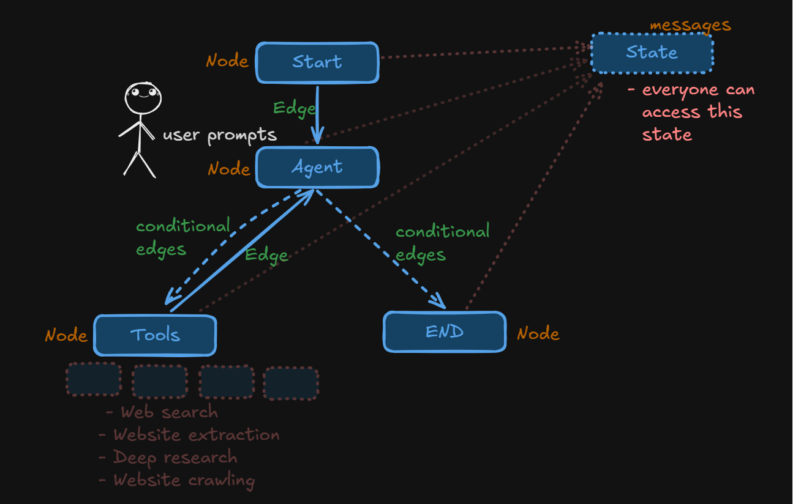
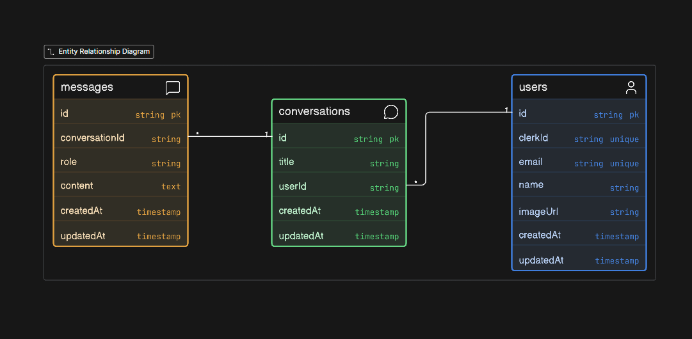

<h1 align="center">🧵 Sutra AI</h1>
<p align="center">
  <em>A thread connecting ideas — AI-powered research assistant built with LangGraph agentic workflows</em>
</p>

<p align="center">
  
  
  
  
  
  
  
  
</p>

---

## Introduction

**Sutra** (Sanskrit for *"thread"*) is a full-stack AI research assistant that goes beyond simple chatbots. It uses a **LangGraph agentic architecture** where an AI agent can autonomously decide to invoke research tools — web search, deep research, website extraction, sitemap mapping, and website crawling — to provide grounded, real-world-accurate answers.

The application features **real-time token streaming**, persistent conversation history, and a beautifully designed dark-themed UI inspired by rope and thread aesthetics.

---

## Features

- **Agentic AI Architecture** — Built with LangGraph's `StateGraph`, the agent autonomously decides when to use tools vs. respond directly via conditional edges
- **Web Research Tools** — Powered by Tavily API with 5 specialized tools:
  - **Web Search** — Search the web for recent information
  - **Deep Research** — In-depth research on any topic
  - **Website Extraction** — Extract content from a specific URL
  - **Sitemap Mapping** — Generate a sitemap of any website
  - **Website Crawling** — Crawl websites with custom instructions
- **Real-time Streaming** — Token-by-token response streaming via NDJSON over `ReadableStream`
- **Conversation Persistence** — Full conversation history stored in PostgreSQL via Prisma ORM
- **Authentication** — User authentication and session management with Clerk
- **Rich Markdown Rendering** — AI responses rendered with GitHub Flavored Markdown, including code blocks, tables, and more
---

## 🏗️ Architecture
<p align="center">
  
</p>


**How it works:**

1. **Start Node** → receives the user's prompt
2. **Agent Node** → LLM (GPT-4.1-mini) processes the message with tool bindings
3. **Conditional Edge** → If the LLM response contains `tool_calls`, route to **Tools Node**; otherwise route to **END**
4. **Tools Node** → Executes the requested Tavily tool(s) and returns results
5. **Loop** → Tools output feeds back into the Agent for further reasoning
6. **END Node** → Final response is streamed back to the user

---


## 📁 Project Structure

```
Sutra/
├── app/
│   ├── (auth)/
│   │   └── sign-in/             # Clerk sign-in page
│   ├── api/
│   │   ├── chat/
│   │   │   └── route.ts         # POST /api/chat — streaming AI endpoint
│   │   └── conversations/
│   │       └── [conversationId]/
│   │           └── route.ts     # DELETE conversation endpoint
│   ├── chat/
│   │   ├── layout.tsx           # Auth-protected chat layout
│   │   ├── page.tsx             # Redirects to /chat/[userId]
│   │   └── [userId]/
│   │       ├── page.tsx         # Server component — loads conversations
│   │       └── chat-client.tsx  # Client component — chat UI + streaming
│   ├── globals.css              # Design system & custom theme
│   ├── layout.tsx               # Root layout (Clerk, fonts, metadata)
│   └── page.tsx                 # Landing page
│
├── components/
│   ├── chat/
│   │   ├── chat-input.tsx       # Message input with send button
│   │   ├── chat-layout.tsx      # Main chat shell (header + messages + input)
│   │   ├── markdown-renderer.tsx# GFM markdown renderer
│   │   ├── message-bubble.tsx   # Individual message bubble
│   │   ├── message-list.tsx     # Scrollable message list
│   │   ├── sidebar.tsx          # Conversation history sidebar
│   │   ├── streaming-indicator.tsx  # Typing indicator animation
│   │   └── welcome-screen.tsx   # New chat welcome view
│   └── ui/                      # Shadcn UI components
│
├── features/
│   ├── ai/
│   │   ├── client/
│   │   │   └── index.ts         # OpenAI LLM + ToolNode initialization
│   │   ├── tools/
│   │   │   └── travily/
│   │   │       ├── index.ts     # Tavily client setup
│   │   │       └── tools.ts     # 5 Tavily tool definitions
│   │   ├── call-model.ts        # Agent node — invokes LLM with tools
│   │   ├── graph.ts             # LangGraph StateGraph definition
│   │   └── system-prompt.ts     # System prompt (markdown formatting rules)
│   ├── auth/
│   │   └── action.ts            # Auth helpers (get user, onboard to DB)
│   ├── conversation/
│   │   └── action.ts            # Conversation queries & ownership checks
│   └── message/
│       └── action.ts            # Message CRUD & LangGraph format conversion
│
├── lib/
│   ├── db.ts                    # Prisma client singleton
│   ├── user-sync.ts             # Clerk → DB user sync utility
│   ├── utils.ts                 # cn() utility (clsx + tailwind-merge)
│   └── generated/prisma/        # Prisma generated client (gitignored)
│
├── prisma/
│   ├── schema.prisma            # Database schema (User, Conversation, Message)
│   └── migrations/              # Prisma migration history
│
├── public/
│   └── image.png                # Architecture diagram
│
├── proxy.ts                     # Clerk middleware configuration
├── package.json
├── tsconfig.json
├── next.config.ts
├── prisma.config.ts
└── pnpm-workspace.yaml
```

---

## 📊 Database Schema
<p align="center">
  
</p>

**Relationships:**
- One **User** → Many **Conversations**
- One **Conversation** → Many **Messages**
- Cascade delete ensures cleanup when users or conversations are removed

---

## How the Streaming Works

1. **Client** sends a `POST /api/chat` with `{ message, conversationId? }`
2. **Server** saves the user message to the database
3. **LangGraph** processes all conversation messages through the agentic workflow
4. **Streaming** — The server creates a `ReadableStream` and uses `app.streamEvents()` to forward tokens:
   - `{ conversationId }` — sent once for new conversations
   - `{ token: "..." }` — individual streamed tokens
   - `{ done: true }` — signals end of stream
5. **Client** reads the NDJSON stream via `ReadableStream` reader and updates the UI in real-time

---

<p align="center">
  <strong>Sutra AI</strong> — <em>Every thought connected, every insight preserved.</em> 🧵
</p>
